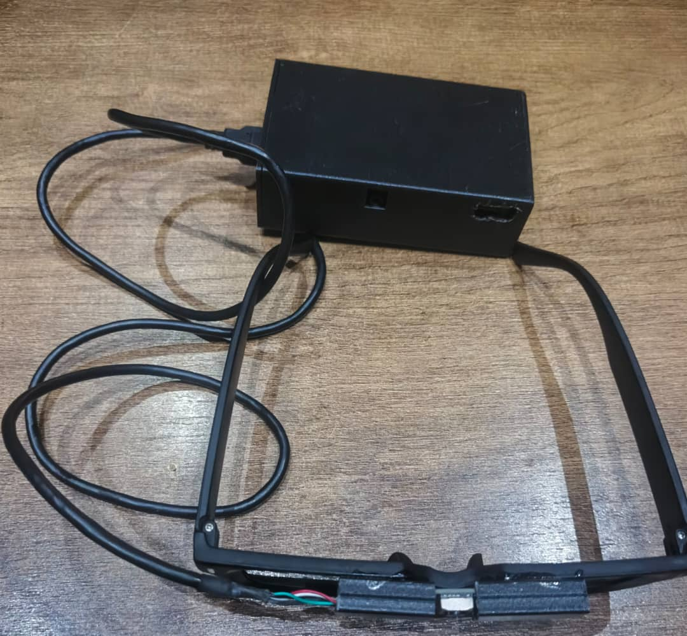
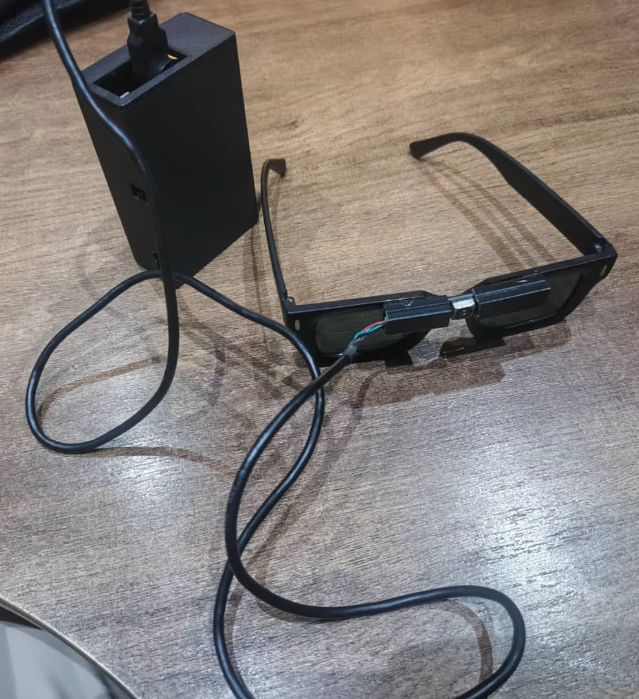
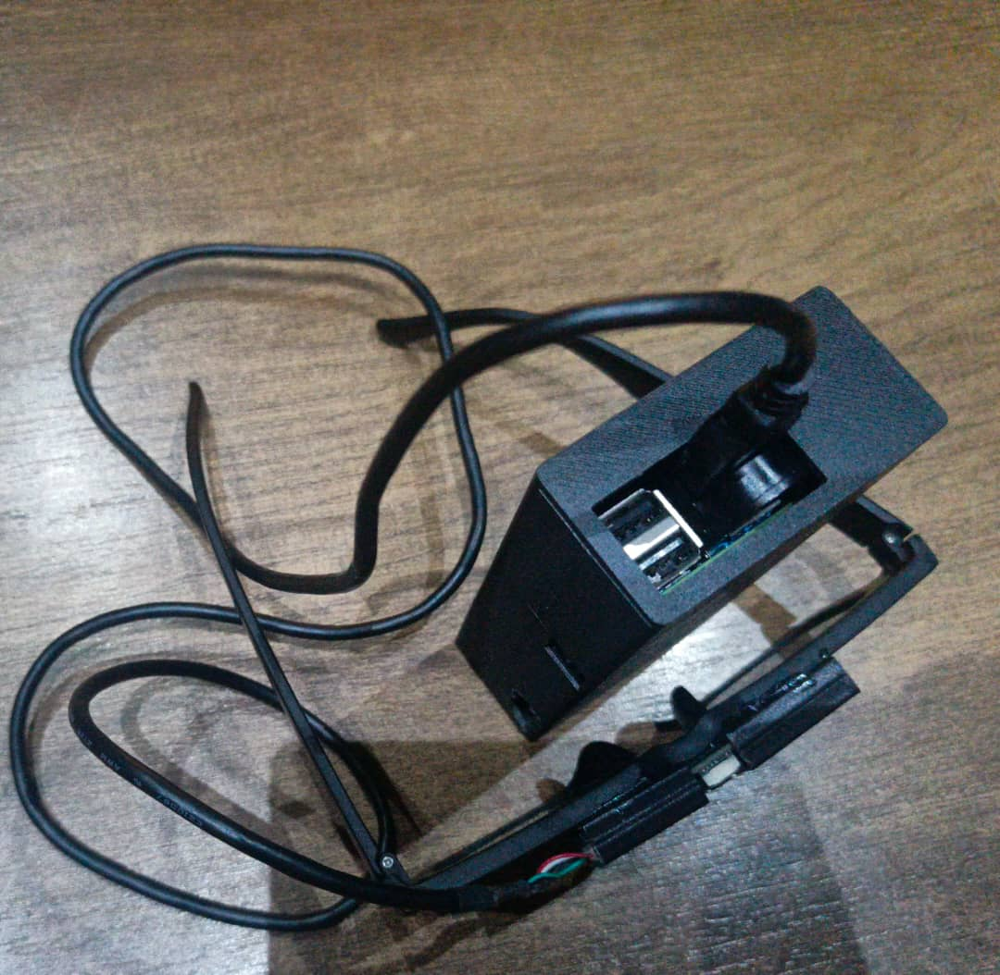

# 🦯 HopeVision — Lunettes intelligentes pour personnes malvoyantes

> Projet de Fin d'Année (Capstone) — Bachelor of Science in Artificial Intelligence  
> African Development University (ADU) Niamey — Promotion 2026

[](https://www.python.org/)
[](https://docs.ultralytics.com/)
[](https://www.raspberrypi.com/)

<p align="center">
  
  <br/>
  <em>Prototype final — lunettes intelligentes avec caméra et module embarqué</em>
</p>

---

## 🎯 Présentation

**HopeVision** est une solution embarquée sous forme de lunettes intelligentes
conçue pour améliorer la mobilité, la sécurité et l'autonomie des personnes
aveugles et malvoyantes au Niger.

Le dispositif combine :

- **Vision par ordinateur** (YOLOv8n) pour détecter les obstacles en temps réel
- **Synthèse vocale** (Piper) pour alerter l'utilisateur
- **Reconnaissance vocale** (Vosk) pour les commandes
- **Lecture de texte** (Tesseract OCR) pour lire les panneaux
- **Communication GSM** (SIM7600G-H) pour les SMS d'urgence par commande vocale

Le tout fonctionne **entièrement hors ligne** sur un **Raspberry Pi 4**.

---

## 🎬 Démonstrations vidéo

### 🔍 Détection d'obstacles en temps réel

<p align="center">
  <a href="videos/Detection.mp4">
    
  </a>
  <br/>
  <strong>▶ <a href="videos/Detection.mp4">Cliquez pour voir la vidéo complète</a></strong>
  <br/>
  <em>Détection YOLOv8n sur Raspberry Pi 4 avec alerte vocale par Piper.</em>
</p>

---

### 📖 Lecture de texte par OCR

<p align="center">
  <a href="videos/lecture.mp4">
    
  </a>
  <br/>
  <strong>▶ <a href="videos/lecture.mp4">Cliquez pour voir la vidéo complète</a></strong>
  <br/>
  <em>Lecture vocale de texte via Tesseract OCR + synthèse Piper.</em>
</p>

---

### 📱 SMS par commande vocale

<p align="center">
  <a href="videos/sms.mp4">
    
  </a>
  <br/>
  <strong>▶ <a href="videos/sms.mp4">Cliquez pour voir la vidéo complète</a></strong>
  <br/>
  <em>Envoi de SMS par commande vocale via le module SIM7600G-H.</em>
</p>

---

## 📊 Résultats

| Métrique  |  Valeur  |  Objectif |
|-----------|---------:|----------:|
| mAP50     | **0,94** |    > 0,85 |
| Précision | **0,92** |    > 0,85 |
| Rappel    | **0,88** |    > 0,80 |

- **3 345 images** collectées et annotées localement sur Roboflow
- **5 classes** : personnes, bouteilles, chaises, motos, voitures
- **Matériel** : Raspberry Pi 4 + caméra USB + PiJuice + SIM7600G-H

---

## 🏗️ Architecture

```text
┌──────────────────┐
│   Caméra USB     │──────┐
└──────────────────┘      │
                          ▼
┌──────────────────┐   ┌─────────────────┐
│  Microphone USB  │──▶│  Raspberry Pi 4 │
└──────────────────┘   │                 │
                       │  ┌───────────┐  │
                       │  │  YOLOv8n  │  │
                       │  └───────────┘  │
                       │  ┌───────────┐  │
                       │  │ Vosk (STT)│  │
                       │  └───────────┘  │
                       │  ┌───────────┐  │
                       │  │Piper (TTS)│  │
                       │  └───────────┘  │
                       │  ┌───────────┐  │
                       │  │ Tesseract │  │
                       │  └───────────┘  │
                       └────────┬────────┘
                                ▼
                       ┌─────────────────┐
                       │    Écouteurs    │
                       │   SIM7600G-H    │
                       └─────────────────┘
```

---

## 📁 Structure du projet

```text
HopeVision/
├── detection.py             # Détection d'obstacles avec YOLOv8n
├── lecture.py               # Lecture de texte par OCR (Tesseract)
├── sms.py                   # Envoi de SMS par commande vocale
├── speech.py                # Reconnaissance vocale (Vosk)
├── camera.py                # Capture caméra
├── micro.py                 # Capture micro
├── batterie.py              # Gestion batterie PiJuice
├── test_bouton.py           # Gestion bouton PiJuice SW3
├── flask_app.py             # Interface web de supervision
├── detection_utils.py       # Utilitaires détection
├── voice_utils.py           # Utilitaires vocaux
├── generate_wavs.py         # Génération des annonces audio
├── sim7600_call_handler.py  # Communication SIM7600G-H
├── listen_sms.py            # Écoute des SMS entrants
├── sms_config.py            # Configuration (variables d'env)
├── annonces.txt             # Annonces vocales
├── sounds/                  # Sons du projet
├── images/                  # Photos du prototype
├── videos/                  # Vidéos de démonstration
└── capstone/                # Rapport et documents
```

---

## 🚀 Installation

### Prérequis matériels

- Raspberry Pi 4 (8 Go RAM)
- Caméra ELP USB
- Mini microphone USB
- Batterie PiJuice HAT
- Dongle SIM7600G-H 4G
- Écouteurs filaires

### Prérequis logiciels

- Raspberry Pi OS (ou Linux)
- Python 3.11+
- Tesseract OCR (`sudo apt install tesseract-ocr tesseract-ocr-fra`)

### Étapes

```bash
# 1. Cloner le dépôt
git clone https://github.com/Sawadogo-cmk/HopeVision.git
cd HopeVision

# 2. Créer un environnement virtuel
python -m venv env
source env/bin/activate

# 3. Installer les dépendances
pip install -r requirements.txt

# 4. Télécharger le modèle Vosk français
wget https://alphacephei.com/vosk/models/vosk-model-small-fr-0.22.zip
unzip vosk-model-small-fr-0.22.zip

# 5. Placer le modèle YOLO entraîné (best.pt) à la racine
#    (voir section "Modèle entraîné" ci-dessous)

# 6. Lancer un module
python detection.py    # détection d'obstacles
python lecture.py      # lecture OCR
python sms.py          # SMS par commande vocale
```

---

## 📦 Modèle entraîné

Le modèle YOLOv8n (`best.pt`, 6 Mo) entraîné sur notre dataset
n'est pas versionné (trop volumineux pour Git).

👉 **[Télécharger `best.pt` (Google Drive)](https://drive.google.com/uc?export=download&id=1lFpWHF4P8xet8yVRrKSGu2IejlzXXrkK)**

---

## 🛠️ Technologies

| Catégorie              | Outils                                  |
|------------------------|-----------------------------------------|
| Vision                 | YOLOv8, OpenCV, Roboflow                |
| Reconnaissance vocale  | Vosk (`vosk-model-small-fr-0.22`)       |
| Synthèse vocale        | Piper TTS (voix Siwis FR)               |
| OCR                    | Tesseract OCR                           |
| Communication          | pySerial, SIM7600G-H                    |
| Backend                | Flask                                   |
| Hardware               | Raspberry Pi 4, PiJuice HAT             |

---

## 👥 Auteurs

Projet réalisé par :

- **Iro Dogo Galadima Halima**
- **Sawadogo Noe** — [@Sawadogo-cmk](https://github.com/Sawadogo-cmk)

Sous la supervision de **M. Moukaila Mahamadou** — African Development University (ADU) Niamey.

---

## 📄 Licence

Projet académique réalisé dans le cadre du Bachelor of Science in Artificial
Intelligence à l'African Development University (ADU), Niamey, 2026.